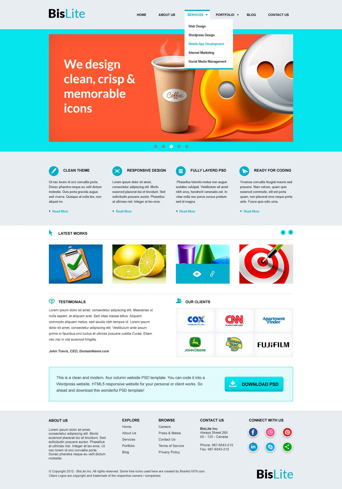
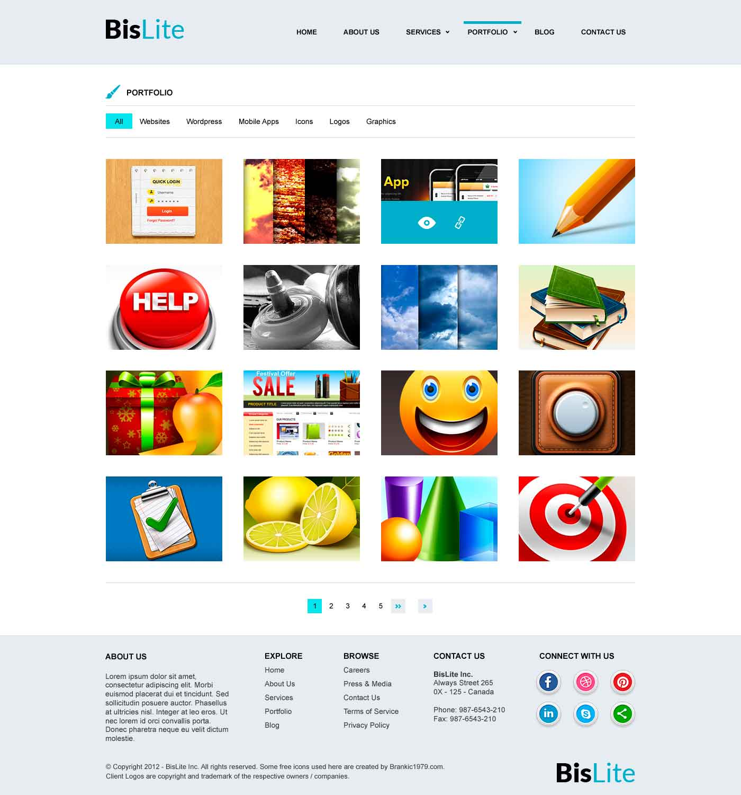
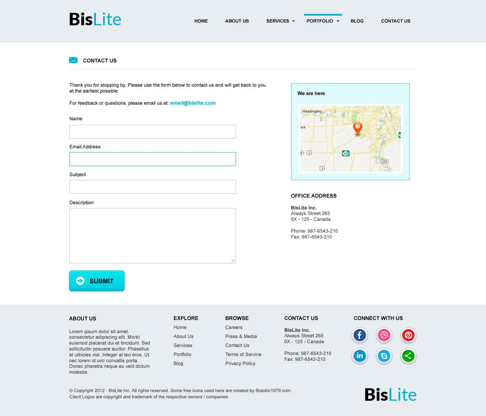

# bislite :smile:

Project for training in creating markup of layout bislite from mailing [htmlacademy](http://htmlacademy.ru/) :+1: 

It contains three html pages: index, portfolio and contact.

